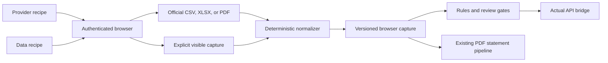

# Browser ingestion

The browser integration is migrated from the previous source app at `Claude/Projects/Finance tracking/_skill_src/bank-statements`. Its provider/data split, closed recipe grammar, verified portal paths, parse-completeness checks, and multi-card handling are retained. The storage and handoff are adapted to the current Actual-first architecture.

## Architecture



Provider recipes own login and session navigation. Data recipes own one acquisition task, including date/card selection and the terminal export action. Recipe parameters are non-secret selectors only. Authentication secrets, MFA, cookies, tokens, PINs, CVVs, and full card numbers are forbidden in recipes and captures.

## Migrated sources

| Provider | Data | Acquisition | Parser | Legacy verification |
|---|---|---|---|---|
| ADCB | Credit-card transactions | Browser CSV | `adcb_csv_v1` | 2026-07-09 |
| ADCB | Credit statement | Browser PDF | `adcb_v1` statement pipeline | 2026-07-09 |
| Emirates Islamic | Credit-card transactions | Browser XLSX | `emirates_islamic_xlsx_v1` | 2026-07-11 |
| FAB | Credit-card transactions | Browser CSV | `fab_csv_v1` | 2026-07-09 |
| FAB | Current-account transactions | Browser CSV | `fab_csv_v1` | 2026-07-09 |
| FAB | Current-account balance | On-screen snapshot | No ledger parser | 2026-07-09 |
| Wio | Credit statement | Email PDF | Existing statement pipeline | 2026-07-11 |
| Generic CSV | Account/card transactions | User upload | `generic_csv_v1` | 2026-07-09 |
| Sarwa | Holdings capture | Explicit JSON upload | Registered; separate wealth snapshot path | 2026-07-11 |

RAKBANK and Standard Chartered remain `ADAPTER_REQUIRED` because the previous app contained no validated browser recipe for them. Their email-statement path remains available.

## Operator flow

1. Validate registry and account coverage:

   ```powershell
   python -m finance_tracker.cli browser-adapters-status --sources config\browser-sources.json --adapters-root browser_adapters
   ```

2. Render the exact instructions. Parameters are JSON and must match the data recipe's declared inputs:

   ```powershell
   python -m finance_tracker.cli browser-render-recipe --provider adcb --data-id credit-card-transactions --params runtime\adcb-params.json --output runtime\adcb-recipe.json
   ```

3. The user completes authentication and MFA. Follow the recipe in the authenticated browser and download the official export.

4. Upload, normalize, and stage through the guarded ingestion worker:

   ```powershell
   .\scripts\ingest-browser-export.ps1 `
     -Provider adcb `
     -DataId credit-card-transactions `
     -File 'C:\path\export.csv' `
     -ActualAccount 'ADCB Credit Card · 8833 / 6838'
   ```

5. Save the returned compact AI handoff, answer every request, perform the selective evidence pass, and re-run with `-AIResponsesPath`, `-AIHandoffComplete`, and any `-EvidenceLinksPath`. Require zero review rows and zero rejected proposals.
6. Re-run the identical source and handoff first with `-ActualMode PREFLIGHT`, then with `-ActualMode COMMIT`. The caller and worker both require `ALLOW_ACTUAL_WRITES=true` for the commit. Stable imported IDs, review gates, and post-write verification remain mandatory; there is no direct bridge bypass.

## Real export validation

The legacy application's original ADCB portal export, not its derived ledger
CSV, was replayed through both the local worker and the deployed ingestion
container on 2026-08-17. The artifact hash was
`32444d7848209c69842e83caeb89fbb273fa46b3064625444576517786a310dc`.
Both paths parsed all 303 candidate rows and produced one account envelope
with no import blocker. Static rules resolved eight cashback credits and three
card-payment credits. A unique, exact merchant/amount refund pair then resolved
the remaining generic credit deterministically; duplicate candidate purchases
remain review-required. Release `174bd885b38a9b3e865bff97a8ae87b490702346`
corrected boundary-sensitive medical and fuel matches, normalized Emirates
Central Cooling to Empower, and separated AWS cloud charges from Amazon retail.

The fixed-point AI handoff expanded from 284 initial requests to 310 final
requests after accepted classifications activated later subscription,
property, and evidence policies. Production STAGE job
`3aafc581a7f823c0ec7e533f` answered all 310 requests, accepted 298 proposals,
rejected none, retained ten exact evidence links, and reached
`READY_FOR_APPROVAL` with zero review rows. Six linked Empower PDFs match exact
account, property/unit, period, and amount. Four sanitized DEWA payment receipts
match exact account, payment reference, date, and amount. Unmatched evidence
candidates remain unlinked instead of being inferred.

Production PREFLIGHT job `03e8f01870380e4c8bc7326c` dry-ran all 303 rows
against `ADCB Credit Card · 8833 / 6838`: 303 additions, zero updates, and zero
errors. After explicit owner approval, production COMMIT job
`f265bf6dddc4361e46e94a55` imported the same 303-row envelope. The bridge's
post-write verification found 303 expected imported IDs and zero duplicates. A
separate fresh Actual snapshot matched every expected imported ID exactly once
and retained all ten evidence notes. Replaying the identical submission returned
the same job with `idempotent_replay: true` and did not run a second import.
Cashback enrichment was correctly omitted because ADCB is not part of the live
cashback profile. A handoff marked complete must answer every emitted request,
including empty responses when evidence is weak; an incomplete PREFLIGHT or
COMMIT is rejected before the Actual bridge is contacted.

## Correctness gates

- The raw artifact SHA-256 contributes to a stable capture identity.
- Bank-specific parsers reject partial parsing when a candidate row cannot be normalized.
- ADCB primary and supplementary card blocks preserve their individual last four digits and roles.
- Pending Emirates Islamic rows remain review-required.
- An implicit credit remains review-required unless a deterministic static rule resolves it to a categorized payment, reward credit, or refund.
- A foreign-currency export without an evidenced AED equivalent is rejected rather than converted or mislabeled.
- Query strings and fragments are removed from recorded portal URLs.
- Browser-state secrets cause capture rejection.
- Untied statement rows are blocked as a batch; official PDFs use the stronger statement arithmetic checks.
- Official transaction exports are not marked cleared. Only reconciled statement rows are cleared in Actual.
- Account balances are point-in-time snapshots, not transactions.
- All operator-facing statement, browser-capture, and browser-export scripts route through the container worker. They cannot prompt for Actual credentials or invoke `actualctl.mjs` directly.

## Extension contract

Add a provider directory containing `provider.json`, `provider.recipe`, and one or more `data/<id>/data.json` plus `recipe` files. Add a deterministic parser only when the acquisition returns a structured artifact. Register the account under `config/browser-sources.json`, add parser and recipe tests, then run the complete test suite.

The closed grammar in `browser_adapters/recipe-grammar.json` is intentionally small. Extend it only when a validated portal requires a new operation; do not embed browser-tool-specific commands or credentials.
