# Browser ingestion

FAB, Sarwa, and Amazon acquisition is user-assisted. The authenticated browser
may download an official artifact or create an explicit visible-data capture,
but it never writes to Actual.

```mermaid
flowchart LR
    R["Versioned provider recipe"] --> B["Authenticated browser"]
    B --> A["Official export or immutable capture"]
    A --> O["OneDrive evidence archive"]
    O --> N["n8n browser-ingestion workflow"]
    N --> P["Parse and normalize"]
    P --> G["Rules, AI proposals, and review"]
    G --> V["Validate and reconcile"]
    V --> X["Direct Actual custom node"]
```

## Source coverage

| Provider | Data | Canonical path |
|---|---|---|
| Amazon UAE | Order evidence | Browser capture to evidence matching |
| FAB | Non-credit-card accounts and transactions | Official export/capture to transaction pipeline |
| Sarwa | Portfolio holdings and values | Interactive capture to `wealth_snapshot_v1` |

ADCB is closed and historical. Other legacy browser sources are not part of the
greenfield scope unless explicitly re-enabled.

## Operator flow

1. Validate the provider/data recipe and the intended account mapping.
2. Open the provider URL. The user completes credentials, MFA, or OTP.
3. Prefer an official CSV, XLSX, or PDF. If unavailable, create an immutable
   visible-data capture with limitations recorded.
4. Archive the original in OneDrive and calculate its SHA-256 identity.
5. Invoke the inactive `INTERACTIVE_BROWSER_INGESTION` n8n workflow with the
   source code and archived-object identity. Do not pass arbitrary local paths.
6. Review parse completeness, account coverage, source balance, classification
   exceptions, and AI proposals.
7. Enable the write branch only after preflight succeeds. The fixed-purpose
   Actual node serializes writes and verifies imported IDs after persistence.

Visible-row captures remain review-required until the owner approves that exact
immutable capture. Approval never clears other currency, account, balance,
classification, or evidence gates.

Sarwa produces off-budget wealth valuations rather than ordinary transactions.
Its refresh remains interactive, stores no browser session, excludes insurance
coverage from net worth, and records an explicit as-of timestamp and FX
snapshot.

## Security boundary

Recipes accept only non-secret selectors. Never persist passwords, PINs, CVVs,
OTPs, cookies, access tokens, session storage, recovery codes, or full account
numbers. There is no HTTP ingestion bridge, SSH uploader, or generic command
runner.
