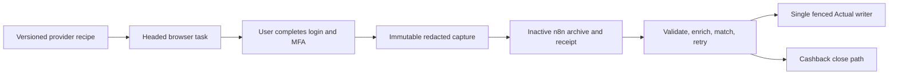

# Browser ingestion

Browser acquisition collects user-authenticated finance data in an on-demand
headed session. The browser task emits one immutable redacted export and never
writes Actual or Cashback.

## Source coverage

| Provider | Capture scope | Result |
|---|---|---|
| FAB | Debit/current-account balance and transaction export | AED transaction or account capture |
| Sarwa | Authenticated holdings and portfolio values | USD wealth snapshot with an as-of timestamp |
| Amazon UAE | Order history evidence | Supplemental evidence for transaction matching |
| ADCB | Historical credit-card export or statement | Redacted historical capture |

Each registered provider declares `HEADED_ON_DEMAND` execution,
`USER_COMPLETED` authentication, disabled session persistence, and the
`browser-capture-schema-v1` output contract.

## Operator flow

1. Choose one provider, one account label, and one data scope.
2. Validate the provider registry and render the provider and data recipes.
3. Open the provider URL in a headed browser and pause at the login page.
4. The user completes login, MFA, OTP, passkey, or reCAPTCHA in the browser.
5. Follow the deterministic recipe and prefer the official CSV, XLSX, PDF, or
   provider-native export.
6. If only visible rows or a balance is available, record the date/as-of value
   and the limitation in the capture. Do not infer omitted values.
7. Set `artifact.source_content_sha256` and
   `provenance.source_content_sha256` to the original export's SHA-256.
   Include the capture ID, UTC timestamp, and `SHA-256` algorithm in
   `provenance`.
8. Serialize the capture with sorted keys, UTF-8, and compact JSON separators.
   Set the envelope's `expected_capture_sha256` to the SHA-256 of those exact
   bytes. Send the same bytes as binary `data` with `artifact_id` and
   `expected_source_sha256` in the envelope to the inactive
   `INTERACTIVE_ARTIFACT_HANDOFF` workflow.
9. n8n parses the binary, rejects forbidden fields, validates the canonical
   schema with AJV, and checks the artifact identity before any upload.
10. A new artifact is uploaded to the configured Finance Evidence root. An
    exact match of both source and capture-binary hashes reuses its durable
    receipt without uploading again. A changed source or capture-binary hash
    for an existing `artifact_id` fails with an exact conflict.
11. n8n writes and reads back `finance_document_operations`, verifies the
    archived hash, and dispatches to the inactive `SHARED_STATEMENT_PIPELINE`
    route.
12. Review n8n validation, enrichment, transaction matching, retry state,
    archive receipt, and writer preflight before any production promotion.

The handoff envelope contains only `artifact_id`, `expected_source_sha256`, and
`expected_capture_sha256`; the capture JSON is a single binary attachment. n8n
records the source hash and the capture-binary hash separately in the durable
receipt. It does not log the capture payload.

## Ownership boundary

| Surface | Owner | Allowed result |
|---|---|---|
| Headed browser | User-assisted Codex task | Visible data or official export |
| Capture archive and validation | Inactive n8n | Hash-bound artifact and redacted receipt |
| Enrichment and transaction matching | n8n | Proposed or staged normalized data |
| Actual ledger mutation | Single fenced Actual writer | Reviewed outbox delta only |
| Cashback mutation and close | Cashback companion and its n8n flow | Source-scoped cashback state |

The headed task never activates n8n, calls Actual, calls Cashback, or creates a
second ledger writer. Amazon order captures remain supplemental evidence and do
not create ledger transactions.

## Security boundary

The user completes authentication in the headed window. Automation never
requests, reads, types, copies, stores, logs, or returns credentials, OTPs,
cookies, session state, PINs, CVVs, recovery codes, full account numbers, or
full payment numbers. Captures retain only user-approved labels or last four
digits. Recorded URLs omit query strings and fragments.

Use the [copy-paste browser task prompt](original-codex-browser-task-prompt.md)
when starting an acquisition from the original Codex app.
