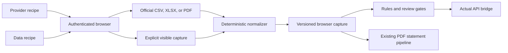

# Browser ingestion

The browser integration is migrated from the previous source app at `Claude/Projects/Finance tracking/_skill_src/bank-statements`. Its provider/data split, closed recipe grammar, verified portal paths, parse-completeness checks, and multi-card handling are retained. The storage and handoff are adapted to the current Actual-first architecture.

## Architecture



Provider recipes own login and session navigation. Data recipes own one acquisition task, including date/card selection and the terminal export action. Recipe parameters are non-secret selectors only. Authentication secrets, MFA, cookies, tokens, PINs, CVVs, and full card numbers are forbidden in recipes and captures.

## Migrated sources

| Provider | Data | Acquisition | Parser | Legacy verification |
|---|---|---|---|---|
| ADCB | Credit-card transactions | Browser CSV | `adcb_csv_v1` | 2026-07-09 |
| ADCB | Credit statement | Browser PDF | `adcb_v1` statement pipeline | 2026-07-09 |
| Emirates Islamic | Credit-card transactions | Browser XLSX | `emirates_islamic_xlsx_v1` | 2026-07-11 |
| FAB | Credit-card transactions | Browser CSV | `fab_csv_v1` | 2026-07-09 |
| FAB | Current-account transactions | Browser CSV | `fab_csv_v1` | 2026-07-09 |
| FAB | Current-account balance | On-screen snapshot | No ledger parser | 2026-07-09 |
| Wio | Credit statement | Email PDF | Existing statement pipeline | 2026-07-11 |
| Generic CSV | Account/card transactions | User upload | `generic_csv_v1` | 2026-07-09 |
| Sarwa | Holdings capture | Explicit JSON upload | Registered; separate wealth snapshot path | 2026-07-11 |

RAKBANK and Standard Chartered remain `ADAPTER_REQUIRED` because the previous app contained no validated browser recipe for them. Their email-statement path remains available.

## Operator flow

1. Validate registry and account coverage:

   ```powershell
   python -m finance_tracker.cli browser-adapters-status --sources config\browser-sources.json --adapters-root browser_adapters
   ```

2. Render the exact instructions. Parameters are JSON and must match the data recipe's declared inputs:

   ```powershell
   python -m finance_tracker.cli browser-render-recipe --provider adcb --data-id credit-card-transactions --params runtime\adcb-params.json --output runtime\adcb-recipe.json
   ```

3. The user completes authentication and MFA. Follow the recipe in the authenticated browser and download the official export.

4. Parse, normalize, stage, and dry-run against Actual:

   ```powershell
   .\scripts\ingest-browser-export.ps1 -Provider adcb -DataId credit-card-transactions -File 'C:\path\export.csv' -ActualAccount 'ADCB Credit Card · 8833 / 6838' -SyncId '<budget-sync-id>'
   ```

5. Inspect `runtime/browser-runs/.../browser-run.json`. Re-run with `-Commit` only after review. A capture based on visible rows also requires `-ApproveReviewedRows`.

## Correctness gates

- The raw artifact SHA-256 contributes to a stable capture identity.
- Bank-specific parsers reject partial parsing when a candidate row cannot be normalized.
- ADCB primary and supplementary card blocks preserve their individual last four digits and roles.
- Pending Emirates Islamic rows remain review-required.
- A foreign-currency export without an evidenced AED equivalent is rejected rather than converted or mislabeled.
- Query strings and fragments are removed from recorded portal URLs.
- Browser-state secrets cause capture rejection.
- Untied statement rows are blocked as a batch; official PDFs use the stronger statement arithmetic checks.
- Official transaction exports are not marked cleared. Only reconciled statement rows are cleared in Actual.
- Account balances are point-in-time snapshots, not transactions.

## Extension contract

Add a provider directory containing `provider.json`, `provider.recipe`, and one or more `data/<id>/data.json` plus `recipe` files. Add a deterministic parser only when the acquisition returns a structured artifact. Register the account under `config/browser-sources.json`, add parser and recipe tests, then run the complete test suite.

The closed grammar in `browser_adapters/recipe-grammar.json` is intentionally small. Extend it only when a validated portal requires a new operation; do not embed browser-tool-specific commands or credentials.
