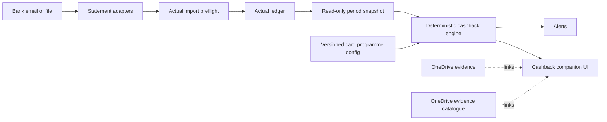

# Cashback control surface decision

## Decision

Build a small companion application for cashback tracking. Do not fork Actual or duplicate Actual's authoritative ledger.

## Why it is not an Actual plugin yet

Actual 26.8.1 includes internal plugin infrastructure, but it does not expose a documented, stable third-party plugin SDK or plugin marketplace. The 2026 roadmap still describes plugins as unfinished. Actual 26.8 instead made `@actual-app/api` usable in a browser specifically for custom tools and UIs.

The supported boundary is therefore a companion application using the official API. Its code can be organized so that UI components and the cashback manifest can be repackaged if a stable plugin SDK is released later.

Do not maintain a private Actual fork. Actual releases monthly and internal React, database, and service-worker interfaces are not a compatibility contract.

## Data ownership

| Data | Owner |
| --- | --- |
| Accounts, transactions, categories, payees, tags, budgets, schedules, reconciliation | Actual |
| Card programmes, tier thresholds, reward caps, eligibility rules, statement-cycle configuration | Cashback companion configuration |
| Calculated pace, headroom, recommendations and alert state | Rebuildable companion snapshots |
| Receipts, bills, warranties, statements | OneDrive originals plus portable JSON catalogue |
| Project documentation and operating decisions | Git |

The sidecar store must not copy the transaction ledger. It may retain programme versions, alert acknowledgements, and calculation snapshots. SQLite is sufficient for that small operational state; PostgreSQL is unnecessary at this scale.

## Why the companion owns live state

Live routing needs repeatable cross-transaction calculations, billing-cycle state, alert acknowledgement, and a dense mobile UI. Programme configuration is versioned in Git; operational state is stored in companion SQLite; evidence is archived in OneDrive.

A dedicated companion removes the chart/dashboard limits and avoids synchronizing a second finance ledger. Evidence links target OneDrive catalogue records and files.

## Existing-project review

- Actual Bench demonstrates that a staged companion/workbench is a supported community pattern, but it focuses on administration, ActualQL, and bulk edits rather than reward optimization.
- Nudlers supports custom billing cycles and a polished dashboard, but its bank integration and domain model are specific to Israeli institutions and it would duplicate Actual's ledger.
- RewardEdge tracks reward caps per billing cycle, but it is an Android/manual-entry product centered on Indian cards.
- General loyalty engines model merchant promotions, not a consumer's multi-card statement cycles and routing decisions.

None is a close enough fit for the UAE card programmes, statement ingestion, and deterministic routing requirements to justify replacing the existing cashback engine.

## Companion architecture

The web service should run beside Actual, bind privately, and be published through its own Cloudflare Tunnel hostname. A server-side Node process holds the Actual password and calls `@actual-app/api`; the browser never receives that credential.

## First screen

The default screen contains only:

- Use now: purchase type and recommended card.
- Avoid now: cards or buckets at cap, or tiers no longer realistically reachable.
- Three compact card tiles: total progress, pace, current tier, and nearest actionable bucket.
- Alerts: third-week under-target, bucket full, unusual weekly pace, and statement/payment due.

Programme editing, transaction diagnostics, full bucket tables, and decision traces belong on subpages.

## Sources

- [Actual 2026 roadmap](https://actualbudget.org/blog/roadmap-for-2026/)
- [Actual 26.8 release notes](https://actualbudget.org/docs/releases/)
- [Actual API browser support](https://actualbudget.org/docs/api/)
- [Actual community projects](https://actualbudget.org/docs/community-repos/)
- [Nudlers](https://github.com/enudler/nudlers)
