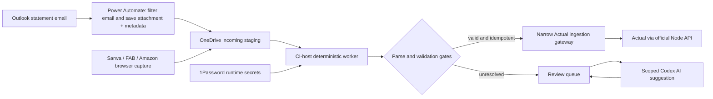

# Deterministic statement-ingestion trigger architecture — 2026-08-19

## Decision

Use **Power Automate only as the Outlook-to-OneDrive acquisition trigger**, then let a **dedicated scheduled worker on the CI host** decrypt, parse, normalize, deduplicate, audit, and submit statements to the existing narrow Actual ingestion gateway.

Do not make Codex, Lambda, or an end-to-end Power Automate flow the authoritative statement writer. Codex remains useful for bounded AI enrichment and evidence review after the deterministic worker has produced a review queue. Sarwa, FAB portal acquisition, and Amazon order/evidence capture remain interactive browser sources with user authentication and the existing browser-capture staging contract.

## Comparison

| Option | Acquisition | Password-protected PDF | Actual/private-network path | Retry, idempotency, audit | Cost/licensing | Complexity | Verdict |
| --- | --- | --- | --- | --- | --- | --- | --- |
| A. Current Codex scheduled tasks | Strong Outlook connector access, but a standalone run creates a new task/chat and local execution depends on the app environment | Possible with local tooling and supplied secrets, but model/tool execution is not the deterministic boundary | Can run local scripts while the desktop is available | Can follow the protocol, but task lifecycle and model/tool availability add operational failure modes | Existing Codex subscription; operational chat accumulation | Medium | Transitional acquisition and AI/review only; retire as authoritative writer |
| B. Dedicated CI-host worker | Needs an inbox/staging source; pair with D | Best fit: package the existing parser/decryptor and inject bank passwords at runtime | Direct private access to the existing gateway/Actual host; no public Actual credential | Best fit for durable job state, content hashes, imported IDs, quarantine, bounded retries, and machine-readable audit | Existing host/container; no per-run cloud compute fee | Low-medium | **Target deterministic executor** |
| C. S3 event + Lambda | Native object-created trigger | Feasible using a Lambda container/layer and Secrets Manager; `/tmp` supports 512 MB–10,240 MB | Actual has no REST API. Lambda would need a service-authenticated narrow public gateway, VPN/overlay, or a pull queue; Cloudflare user/AD login is not an unattended service credential | S3 notifications are at-least-once and unordered, so object/message/content idempotency is mandatory | Statement volume should fit Lambda's free tier in many accounts, but S3, secrets, logs, and network services still apply | Medium-high | Technically viable, but unnecessary cloud/network/secret surface for this deployment |
| D. Power Automate Outlook to OneDrive, then B | Native sender, folder, subject, and attachment filters; both connectors are Standard | Preserve the encrypted PDF. Decrypt only on the CI host; do not put bank passwords in the flow | No connection to Actual is needed from Power Automate | Flow delivery can duplicate or skip edge cases, so save stable message/attachment metadata and let B deduplicate; use incoming/processing/success/quarantine states | Standard connectors are available with limited Microsoft 365/Free capabilities; confirm tenant entitlements | Low | **Target acquisition trigger** |
| E. Power Automate Standard end-to-end | Native Outlook trigger | Not suitable: AI Builder requires password locks removed before submission; Standard has no robust bank-PDF decrypt/parser | A custom/external connector is Premium; private access generally needs a gateway and its payload limits apply | Expressions and flow state would duplicate tested parser logic and make exact replay/versioning harder | Premium currently lists at USD 15/user/month; Process at USD 150/bot/month, before AI capacity or third-party PDF services | High | Reject |

## Why D + B is the best fit

1. **The cloud flow does one reversible job.** Use Office 365 Outlook `When a new email arrives (V3)` with configured folder, sender, subject, and `Only with Attachments`. Microsoft warns that including attachment bodies directly in the trigger can time out; set `Include Attachments` to `No`, enumerate attachments, and use `Get Attachment (V2)`. Save each PDF with OneDrive `Create file`, plus a JSON sidecar containing the immutable Outlook message ID, attachment ID/name, sender, subject, and received time. [Office 365 Outlook connector](https://learn.microsoft.com/en-us/connectors/office365/), [OneDrive connector](https://learn.microsoft.com/en-us/connectors/onedriveconnector/)
2. **The host owns all financial semantics.** The worker computes the content SHA-256, decrypts with runtime-injected 1Password values, parses with the versioned bank adapter, normalizes, applies static rules, validates totals, and writes a success/quarantine receipt. Passwords never enter OneDrive metadata or a Power Automate expression.
3. **Actual remains private.** Actual explicitly does not expose an HTTP/REST API. Its official interface is the Node `@actual-app/api`, which runs the budget engine locally and syncs to the server. The existing ingestion gateway should therefore be the narrow authenticated boundary; the host-side bridge uses the official API. Never give an upstream cloud function the Actual server password when a scoped ingestion token is sufficient. [Actual API](https://actualbudget.org/docs/api/)
4. **At-least-once delivery is harmless.** Deduplicate first by Outlook message ID + attachment ID, then by content hash, and finally by the canonical transaction/imported ID. A retry must return the original completed job result instead of importing again.
5. **AI is optional.** Deterministic ingestion must finish without AI. Unresolved payee/category/evidence fields enter a review queue. Codex or another model may propose values, but cannot change amount, source identity, dedupe key, reconciliation state, or reward arithmetic.

## Power Automate flow contract

The acquisition flow should be one flow per issuer contract, generated from versioned configuration where possible:

1. Trigger on the exact mailbox folder and configured sender/subject fragment.
2. Require at least one PDF attachment; reject inline images and signatures.
3. Fetch attachment content separately with `Get Attachment (V2)`.
4. Create the encrypted PDF under `Finance Evidence/staging/incoming/<issuer>/<message-id>/`.
5. Create a sidecar JSON record with schema version, message ID, attachment ID, received time, sender, subject, original filename, and OneDrive item/path identity.
6. Treat `already exists` as a possible replay, not an error requiring a new filename.
7. Never decrypt, classify, or call Actual in the flow.

Microsoft documents that the Outlook trigger can run twice with some Defender Dynamic Delivery configurations, can skip messages moved into a folder based on received-time ordering, and skips messages above the Exchange limit or 50 MB. These are why the local worker needs reconciliation scans and why statement-close must still fail closed until the expected statement evidence is present. [Office 365 Outlook connector limitations](https://learn.microsoft.com/en-us/connectors/office365connector/)

## Security and networking

- Run the worker inside the existing host network and expose no new public listener.
- Inject statement passwords and gateway credentials at container start from the dedicated 1Password vault; do not bake them into images, repository configuration, sidecars, logs, or error payloads.
- Give the worker a scoped ingestion token. Keep the Actual password local to the official API bridge.
- If a cloud service must call the host later, use a narrowly scoped machine-to-machine Cloudflare Access service token and a single idempotent job endpoint. Do not reuse the interactive AD policy or user session.
- The Microsoft on-premises data gateway is an alternative for private Power Automate calls, but it is a locally installed bridge, custom connectors are Premium, and write payloads through the gateway are limited to 2 MB. It provides no advantage over OneDrive staging for statement PDFs. [Gateway architecture and limits](https://learn.microsoft.com/en-us/data-integration/gateway/service-gateway-onprem), [custom connector FAQ](https://learn.microsoft.com/en-us/connectors/custom-connectors/faq)

## Why not S3 + Lambda now

S3 can invoke Lambda asynchronously when an object is created, and Lambda's encrypted ephemeral storage is ample for PDFs. However, S3 events are delivered at least once, are not ordered, and may be duplicated. The design still needs the same idempotent job store, parser container, secrets, and audit trail, while also adding an S3 landing path and a secure network bridge back to private Actual. At this low volume, compute cost is negligible—Lambda lists one million requests and 400,000 GB-seconds in its free tier—but operational complexity and credential exposure dominate cost. [S3-to-Lambda](https://docs.aws.amazon.com/lambda/latest/dg/with-s3.html), [S3 event delivery semantics](https://docs.aws.amazon.com/AmazonS3/latest/userguide/notification-how-to-event-types-and-destinations.html), [Lambda ephemeral storage](https://docs.aws.amazon.com/lambda/latest/dg/configuration-ephemeral-storage.html), [Lambda pricing](https://aws.amazon.com/lambda/pricing/)

## Why not Power Automate Standard end-to-end

Standard Outlook and OneDrive connectors can move the source file, but they cannot reproduce the current tested decryption, multi-bank parsing, normalization, reconciliation, and Actual-write pipeline. AI Builder is not a substitute: Microsoft requires password locks to be removed and limits document processing inputs to 20 MB. Calling an external parser/ingestion API through a custom connector makes the connector Premium and moves the important logic outside Power Automate anyway. [AI Builder document requirements](https://learn.microsoft.com/en-us/ai-builder/form-processing-model-requirements), [Power Automate license types](https://learn.microsoft.com/en-us/power-platform/admin/power-automate-licensing/types), [Power Automate pricing](https://www.microsoft.com/en-us/power-platform/products/power-automate/pricing)

## Staged migration

### Stage 0 — keep current behavior observable

- Keep the current Codex schedules unchanged while the new path is built.
- Record acquisition, parsing, import, verification, and cursor/receipt identifiers for every run.
- Do not allow both old and new paths to author the same statement without shared idempotency keys.

### Stage 1 — OneDrive landing POC

- Build one Power Automate flow for one issuer.
- Land the encrypted PDF and sidecar only.
- Replay duplicate delivery, delayed delivery, wrong subject, multiple attachments, non-PDF attachments, and password failure.
- Prove no finance data is written in this stage.

### Stage 2 — shadow deterministic worker

- Run the host worker on landed artifacts in parse-only mode.
- Compare its normalized manifest and totals with the current accepted pipeline.
- Require stable SHA/message/attachment/imported IDs and machine-readable receipts.

### Stage 3 — guarded Actual write

- Enable the narrow ingestion gateway for one issuer behind the existing Actual write guard.
- Verify job completion, Actual sync, exact imported IDs, statement totals, and zero duplicate rows.
- Quarantine failures without advancing statement-close state.

### Stage 4 — cut over issuer by issuer

- Disable that issuer's Codex deterministic write step only after repeated successful shadow and guarded-write runs.
- Retain Codex for review/evidence enrichment and lifecycle cleanup.
- Repeat for the remaining email statement sources.

### Stage 5 — operational hardening

- Add missed-statement reconciliation scans, alerting, retention, backup/restore evidence, and a dashboard for incoming/processing/quarantine/success counts.
- Keep Sarwa, FAB, and Amazon browser capture explicitly interactive; their artifacts enter the same deterministic staging boundary after login/export.

