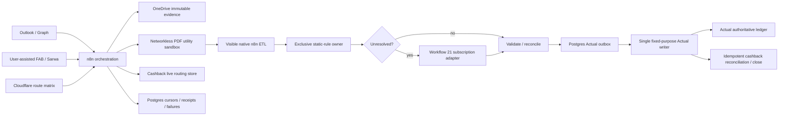

# End-to-end finance platform project plan

Date: 2026-08-19  
Revision: 2, amended after independent adversarial review  
Decision: **GO for repository-only implementation; NO-GO for deployment, MCP
exposure, schedule cutover, or production finance writes until Phase 0–3 gates
pass**

The adversarial review is retained in
`docs/end-to-end-project-plan-red-team-2026-08-19.md`. Its fifteen findings are
accepted and incorporated below.

## 1. Required outcome

Deliver a production-validated, Actual-first finance platform where:

- n8n is the only scheduler and orchestration surface;
- Actual is the sole posted-transaction, account, budget, schedule, rule, and
  reporting ledger;
- the cashback PWA owns live routing state and accepted notification events;
- OneDrive owns immutable statements, receipts, bills, warranties, and message
  snapshots;
- Postgres owns n8n workflow, credential, cursor, idempotency, outbox, and
  execution-receipt state, but never duplicates finance transactions;
- deterministic source parsing, source direction/topic, normalization,
  reconciliation, and cashback arithmetic precede AI;
- scoped AI proposes only unresolved classifications/evidence policies through
  a fixed, schema-constrained subscription adapter;
- user-assisted browser capture covers FAB and Sarwa; generic email enrichment
  covers Amazon and other merchant order evidence;
- FAB non-credit accounts, Sarwa wealth, ADCB at AED 0, net worth, notes,
  refunds/transfers/rewards, budgets, schedules, owners, evidence, and reports
  reconcile to authoritative sources;
- the application and card/routing configuration are reusable for unrelated
  users and fictional card programmes without executable hardcoding.

Completion requires every acceptance requirement to be `VERIFIED` with fresh,
machine-readable repository, runtime, and UI evidence.

## 2. Greenfield boundary and exclusions

Greenfield means **no legacy ingestion bridge code, image, container, port 5020,
credential, workflow dependency, compatibility layer, or migrated bridge job
state**. Immutable source and audit artifacts may be retained. After a read-only
forensic baseline and verified backup, the live legacy container/stack is
stopped and removed in Phase 0; an ingestion maintenance window is preferable to
preserving the bridge as a fallback.

Also excluded:

- Notion and the legacy workbook as runtime/account sources;
- recurring ADCB ingestion; the card is closed and historical;
- Wio cashback tracking and EI live transaction scans;
- persisted browser cookies, MFA state, PINs, CVVs, full account numbers;
- synthetic balancing rows or invented investment cashflows;
- caller-selected commands, filesystem paths, providers, credentials, mailbox
  folders, senders, OneDrive destinations, Actual IDs, or commit flags;
- external PDF/AI services without explicit per-document approval and local
  deterministic reconciliation.

## 3. Current authoritative baseline

Repository:

- finance branch `codex/n8n-finance-orchestration`, draft PR #2; the current
  Phase-1 changes remain unpushed pending this review cycle;
- private `srobroek/finance-n8n-orchestrator` is at `7dafc63` with passing
  compose, network, secret, image-lock, and runner-boundary checks;
- **18** inactive `SPEC_ONLY` workflow exports and Postgres-backed state
  contracts exist; none has yet imported or executed in disposable n8n;
- the fixed-purpose finance nodes, networkless PDF utility, and direct
  subscription adapter are implemented and locally tested but their exact
  images have not yet passed Linux/container/runtime acceptance;
- Python, Actual, custom-node, and subscription-adapter tests pass but do not prove
  deployed workflows or production finance state.

Runtime on `ci@172.20.10.20`:

- Actual, proxy, and cashback are running; the legacy ingestion bridge/runtime
  has been removed rather than retained as a fallback;
- n8n and n8n Postgres are not deployed;
- the subscription adapter's credential binding and three-receipt path are not
  yet proven;
- Sarwa is absent from Actual; FAB inventory/opening evidence is incomplete;
- ADCB zero is not proven; Actual UI/API state has diverged;
- existing Codex schedules remain the active orchestration.

No runtime or production-finance claim may be inferred from documentation,
workflow JSON, or a green unit test alone.

## 4. Target architecture and trust boundaries

### State ownership

| State | Authoritative owner |
|---|---|
| Posted finance rows/accounts/budgets/schedules/rules/reports | Actual |
| Accepted live cashback events, routing, alerts, periods | cashback SQLite |
| Live-source cursors already owned by cashback | cashback SQLite only |
| Statement/browser acquisition cursors and pipeline receipts | n8n Postgres |
| Evidence binaries and immutable source | OneDrive |
| Workflow/config versions and operational outbox | n8n Postgres + Git contract |
| Provider holdings/FX snapshots | immutable versioned snapshot store/OneDrive |

Accepted notification events affect routing immediately and have no approval or
“provisional” UI. Reconciliation state remains internal. Only a reconciled
statement finalizes/resets a cashback period.

### Cloudflare route matrix

| Host/path | Audience | Authentication | Origin |
|---|---|---|---|
| `n8n.vxsan.com` | interactive UI/OAuth callback | AD + n8n login | existing `Home-beachhead` tunnel to `http://172.20.10.20:5678` |
| `n8n-mcp.vxsan.com/mcp/finance-operations-v1` | bounded MCP façade | Cloudflare Service Auth + façade auth | existing `Home-beachhead` tunnel to `http://172.20.10.20:5678` |
| public webhooks | none by default | source-specific only when introduced | no blanket bypass |

The existing external `Home-beachhead` tunnel has two active connector replicas
for availability. Both n8n hostnames route through that one logical tunnel to the
single exact LAN listener `172.20.10.20:5678`; the Compose stack does not run a
cloudflared sidecar. Postgres, PDF utility, and task runners do
not publish host ports. Leave the origin Host-header override unset unless a
tested origin requirement proves otherwise. Verify forwarded headers, no-cache,
WebSockets, OAuth callback, Access policy order, positive and negative Service
Auth, route isolation, and the absence of wildcard, localhost, or public-IP
listeners.

## 5. Mandatory cross-cutting invariants

1. Global production concurrency starts at `1`.
2. All Actual mutations pass through one writer subworkflow and a
   process-independent fenced lease.
3. Actual outbox states are `PREPARED → ACTUAL_OBSERVED → VERIFIED → COMMITTED`;
   recovery observes deterministic imported IDs before retrying.
4. Pre/post sync and `shutdown()` run for every Actual API session.
5. Cashback close is a separate idempotent step after verified Actual readback.
6. Manual/MCP executions cannot enter mutation mode.
7. Every mail sweep freezes `run_upper_bound`, exhausts pagination, returns
   exactly one aggregate item even when empty, records exact scanned count, and
   commits its cursor once after durable downstream success.
8. Monthly acquisition polls the configured cycle window until the expected
   statement arrives or a deadline alert fires; it is not a seven-day one-shot.
9. Set/Edit Fields nodes shape payloads only; they never count as durable
   receipts.
10. Every production workflow writes/reads a real terminal receipt and attaches
    the redacted error workflow.
11. Sensitive document workflows save neither successful nor failed execution
    payloads, pinned data, decrypted binary, nor extracted statement text.
12. QPDF/parsers run in an unprivileged, read-only, networkless utility sandbox
    with tmpfs, fixed arguments, seccomp/AppArmor, CPU/memory/PID/time limits,
    digest-pinned image, SBOM, and no finance credentials.
13. `N8N_BLOCK_ENV_ACCESS_IN_NODE=true`; workflows cannot read process secrets.
14. Actual/static rule ownership is exclusive per rule/action. Representable
    AutoCat pre/default/post rules execute in Actual; only non-representable
    deterministic stages execute before import. Overlap is a build failure.
15. `reimportDeleted:false`, deterministic imported IDs, returned-error checks,
    locked source semantics, and post-import invariant checks are mandatory.
16. Production mutation is forbidden until disposable double replay, manual
    state review, exact delta approval, and UI/API identity parity.

## 6. Independent review disposition

| Red-team finding | Disposition and plan location |
|---|---|
| 1 bridge contradicts greenfield | accepted; Phase 0 removes live runtime after forensic baseline |
| 2 spec is inconsistent/non-executable | accepted; Phase 0 freezes node/schema names; Phase 1 builds/import-tests image |
| 3 mail can silently lose data | accepted; invariant 7–8 and Phase 3 failure matrix |
| 4 receipts are transient/error detached | accepted; Phase 0 state schema and Phase 3 durable readback |
| 5 Postgres does not serialize Actual | accepted; invariants 1–6 and outbox/fencing tests |
| 6 rules may apply twice | accepted; invariant 14–15 and compiler parity gate |
| 7 persistent secrets/env conflict | accepted; Phase 2 secret injection and restore/rotation tests |
| 8 instance MCP overpowered/ineligible | accepted; dedicated MCP Server Trigger façade, instance MCP off |
| 9 Cloudflare topology unproven | accepted; explicit route matrix and Phase 2 tests |
| 10 failed executions retain documents | accepted; invariant 11 and induced-failure inspection |
| 11 parser shares credential boundary | accepted; isolated document utility, not a finance worker |
| 12 acceptance ledger is weak | accepted; Phase 0 evidence schema and downgrade audit |
| 13 production writes precede replay | accepted; Phases 4–5 are capture/plan only; writes move to Phase 7 |
| 14 cashback/reuse under-specified | accepted; Phase 3 and feature inventory below |
| 15 wealth/finance inventory incomplete | accepted; Phase 4 and named feature inventory below |

## 7. Workstreams and agent ownership

| Workstream | Implementer | Reviewer | Paths/scope |
|---|---|---|---|
| Specification, acceptance, state contracts | root | adversarial plan agent | docs, config schemas, workflow registry |
| n8n custom nodes and isolated PDF utility | node agent | root | TypeScript package, image, fixtures, CI |
| n8n platform/Cloudflare/secrets/operations | platform agent | root | orchestrator repo, Postgres, backup, MCP façade |
| executable workflows and mail resilience | workflow agent | root | n8n exports, Data Tables, failure tests |
| FAB/Sarwa/ADCB and finance delta | finance-state agent | root | capture, proposals, corpus/reports; no early writes |
| integration/promotion/completion audit | root | all agents | disposable and production evidence |

Agents use non-overlapping files or coordinate shared contracts first. No agent
may mutate production finance data independently.

## 8. Ordered phase plan

### Phase 0 — Specification and safety freeze

Repository-only plus read-only runtime inventory, except explicitly approved
removal of the legacy runtime after backup.

1. Record Git SHAs, image/container IDs, Actual sync/file identity, account
   balances/IDs, cashback state, installed schedules, Cloudflare tunnel topology,
   and latest backup receipt.
2. Back up Actual/cashback and perform disposable restore verification.
3. Preserve immutable source/audit artifacts from the legacy runtime, then
   stop/remove its container, stack, port, and credentials. Record a maintenance
   window. Do not migrate its job/cache state.
4. Repository-wide remove/label remaining bridge references.
5. Freeze one custom package name/version and node types. Align all 15 exports,
   registry, Data Table metadata, credentials, and subworkflow identifiers.
6. Label workflows `SPEC_ONLY`, `TESTED_IN_DISPOSABLE`, `SHADOW`, or
   `PRODUCTION`; initial state is `SPEC_ONLY`.
7. Define JSON Schemas for every inter-node/source/config/proposal/outbox/
   receipt payload.
8. Define Postgres migrations/tables for source cursors, source/archive receipts,
   documents, pipeline runs, Actual outbox/verification, reconciliations, config
   versions, circuit breakers, and redacted failures.
9. Replace `config/project-acceptance.json` with a schema-validated evidence
   ledger containing requirement, verifier, exact command/test, invariants,
   environment/sync ID, artifact URI+SHA256, observed/expiry time, reviewer, and
   dependencies. Downgrade unsupported claims.
10. Define rule ownership and generate an overlap report that must be empty.

Exit: verified baseline/restore, bridge runtime absent, coherent SPEC_ONLY
contracts, verifiable acceptance schema, and no production finance mutation.

### Phase 1 — Build artifacts in CI

1. Create a TypeScript `n8n-nodes-finance` package with narrow nodes:
   - issuer statement parsing only;
   - non-representable deterministic normalization/rule operations only;
   - direct Actual doctor/read/preflight/import/verify operations only.
2. Create the isolated PDF utility service/image; it exposes only validate,
   unlock, and parse-profile operations over ephemeral input.
3. Build a digest-pinned custom n8n image containing the reviewed custom nodes,
   not QPDF or arbitrary command facilities.
4. Add lockfiles, schemas, unit/parity/security fixtures, SBOM, image scan, and
   container smoke tests.
5. Add disposable CI that imports all workflow exports into the exact n8n image,
   resolves every node/credential/subworkflow, binds schema-migrated Postgres,
   publishes where required, and executes one fixture per non-placeholder flow.

Exit: reproducible images, zero unknown nodes, all imports/executions pass, and
no bridge endpoint or hidden all-in-one worker.

### Phase 2 — Disposable platform and security validation

1. Deploy n8n/Postgres/runners/PDF utility in a disposable environment with all
   workflows inactive and writes disabled.
2. Use a dedicated `FinanceAutomation` 1Password vault/service account. Batch
   retrieve at deployment but inject secrets through `op run` and/or mounted
   runtime secret files; never render resolved values into durable `.env`.
3. Store statement passwords and service tokens as encrypted n8n credentials.
   Preserve the stable n8n encryption key separately from database backups.
4. Prove noninteractive cold start, least privilege, secret rotation, credential
   decryption after restore, and absence from Git, compose output, inspect,
   workflow expressions, logs, executions, and backups.
5. Deploy/test Cloudflare route matrix, AD UI, WebSockets, OAuth callback,
   Service Auth, origin firewall, forwarded headers, and token rotation.
6. Keep instance-level MCP disabled. Deploy a dedicated MCP Server Trigger
   façade exposing fixed operation codes resolved to trusted server contracts.
7. Back up/restore Postgres and the n8n volume; run the security audit.

Exit: disposable platform, secrets, Cloudflare, MCP façade, backups, and
security tests pass; production remains untouched.

### Phase 3 — Executable resilient workflows

Implement and failure-test inactive workflows for:

1. Outlook/Graph paginated acquisition with empty heartbeat and exact source
   contracts;
2. OneDrive archive/hash/dedupe and immutable source receipts;
3. document state machine/quarantine with no sensitive execution retention;
4. EI and Wio monthly statements;
5. RAK and SC monthly placeholders that cannot activate without real fixtures;
6. RAK live cashback and SC placeholder;
7. bounded subscription proposal fixed point: Workflow 21 submits only
   redacted unresolved fields and policy/config hashes to direct pinned
   subscription nodes with a checked-in output schema. n8n validates and
   rejects protected-field output before review; job/idempotency/receipt state
   is durable;
8. selective receipts/bills/warranties using strong evidence and durable-goods/
   value/category policies;
9. interactive FAB/Sarwa artifact handoff and generic email order/document
   enrichment;
10. single Actual writer/outbox/recovery and separate cashback close;
11. redacted error/status/recovery workflows;
12. bounded MCP operations for status, reviewed artifact handoff, and document
    request only.

Required mail tests: zero messages, 101+ messages, pagination failure, run
delayed beyond seven days, out-of-order arrival, duplicate message/attachment/
hash, multiple candidates, no attachment, late statement, and failure around
cursor commit. Every test proves exact scanned count/window and no skipped data.

Required writer tests: concurrent schedule/manual attempts, process kill at each
outbox boundary, stale Actual cache, browser sync race, duplicate replay, one
Actual row, one cursor advance, and idempotent cashback close.

Required PDF tests: encrypted/plain/corrupt/polyglot/oversize/decompression-bomb,
timeout/OOM isolation, network denial, fixed-command rejection, and induced
post-decryption failure proving no sensitive persistence.

Exit: workflow receipts/readback survive restart; all failure matrices pass;
flows become `TESTED_IN_DISPOSABLE`, not SHADOW.

### Phase 4 — Source capture and proposed finance delta only

No Actual production writes.

1. User-assisted FAB inventory of every non-credit account, maximum official
   history, balance/as-of, and evidenced or replaceable derived opening amount.
2. User-assisted Sarwa holdings, positions, cash, price/FX provenance, fresh
   as-of, stale threshold, historical valuation snapshot, and per-portfolio/
   provider reconciliation. Exclude insurance and closed Classic.
3. ADCB evidenced closing payment plan, closed status, and proposed AED 0
   readback—never a balancing transaction.
4. Full transaction corpus plan for source topic/sign, EI Amazon refunds,
   transfers/rewards/reversals, normalization, categories, tags, evidence, exact
   Amazon splits, and one review queue.
5. Note-v2 plan: tags first; no routine source/message/FX/original data,
   `#browser-import`, `#primary`, or derived cashback tags; enforce home/rental
   and rental-unit invariants.
6. Export/fingerprint all manual Actual categories, payees, notes, splits,
   transfers, reconciliations, schedules, and corrections; resolve the 42 known
   conflicts.
7. Produce exact proposed accounts, transactions, budgets, schedules, owners,
   reports, and dashboard delta with writes disabled.
8. Resolve Actual UI/API file identity and export local-only state before any
   client reset.

Exit: complete reviewed source/delta evidence and balance/net-worth equations;
no production mutation.

### Phase 5 — Disposable double replay and functional acceptance

1. Restore a disposable Actual instance from the verified production backup.
2. Apply the exact proposed delta through n8n twice.
3. Prove zero duplicates, missing IDs, balance drift, note violations, topic/
   sign defects, lost manual state, or non-idempotent receipts.
4. Reconcile UI/API file/account/transaction IDs and signed balances.
5. Validate budgets, schedules, owner/property tags, saved dashboards/reports,
   evidence links, category review, subscriptions/bills, savings, rental,
   investment, retirement/SWR, Sankey, and MoM/YoY equations.
6. Validate cashback public configuration and UX with at least three materially
   different fictional portfolios; exhaustive tier/cap/routing tests; iPhone 13
   Pro Max screenshots; PWA install; foreground/background push; weekly pace;
   history selector; EI unlimited/stale; period close/reset history.
7. Restart and restore the disposable platform and rerun interrupted outbox and
   cursor cases.

Exit: exact reviewed delta and double-replay/functional/restore receipts. Only
then may production promotion be proposed.

### Phase 6 — Controlled production promotion

1. Take a fresh verified backup and confirm the approved delta hash.
2. Import/activate one source at a time with global concurrency one.
3. Verify every changed ID, balance, note, rule trace, report, and UI/API value.
4. Run each replacement in live shadow mode before enabling mutation/schedule.
5. Require three consecutive non-empty-or-valid-empty scheduled receipts with
   exact windows; then disable the matching Codex task.
6. Preserve failures in n8n operations, not per-run Codex chats.

Exit: every active source is `PRODUCTION`, all finance-state requirements read
back correctly, and no obsolete Codex schedule remains active.

### Phase 7 — Observation, operations, and release

1. Observe a real statement/reconciliation/period-close cycle per active issuer.
2. Force/verify routing-change, bucket-full, weekly under/over, close-window,
   stale-feed, and failure notifications.
3. Independently restart Postgres, n8n, runners, PDF utility, Actual, proxy, and
   cashback without cross-stack recreation.
4. Perform disposable restores of Actual/cashback and n8n/Postgres.
5. Publish Docker/Dockge, 1Password, Cloudflare, source-adapter, workflow,
   backup/restore, incident, card-profile, and public fictional-profile docs.
6. Run the final machine-generated requirement audit; every evidence record must
   be present, fresh, environment-bound, hashed, independently reviewed, and
   non-empty.

Exit: all acceptance rows are `VERIFIED`; no required work remains.

## 9. Named functional inventory and proof

| Capability | Required proof |
|---|---|
| AutoCat rules | canonical compiler parity; exclusive Actual/non-Actual owner; pre/default/post trace |
| AI rules/recommendations | unresolved-only proposal contract; protected-field rejection; category recommendation review |
| Refund/reward/transfer | EI/ADCB fixtures plus full positive-credit exception report |
| Notes/tags | full-corpus grammar scan and user-visible UI spot check |
| Owners/shared | every account/card owner mapped; filtered transaction/report equations |
| Properties | `#rental` + one unit tag, home exclusivity, income/cost/occupancy reports |
| Evidence | exact links, selective durable-goods policy, OneDrive path/hash/catalogue reconciliation |
| Budgets | reviewed monthly/annual envelopes, rollover, savings goals, cleanup sources/sinks |
| Schedules | utilities, telecom, mortgage, Sarwa, subscriptions, rents, card-payment ranges |
| Mortgage | disabled ADIB profile, verified IPMT/PPMT, no activation without real account |
| Reports | overview, review, categories, trends, tags, shared/owner, bills/subscriptions, property, savings, wealth, retirement, Sankey |
| Wealth | fresh FAB/Sarwa, price/FX source/time, historical series, stale indicator, signed UI/API parity |
| Cashback | arbitrary public schema, fictional portfolios, live routing, weekly pace, alerts, history, mobile/PWA/push |
| Browser sources | user-assisted FAB/Sarwa, no session persistence, immutable artifact handoff; merchant order evidence uses email enrichment |
| Mail/PDF | exact source contracts, pagination/empty heartbeat, isolated extraction, quarantine/replay |

## 10. Acceptance evidence contract

Each requirement record must contain:

- stable requirement ID and explicit invariant;
- authoritative verifier and exact command/test;
- expected and observed result;
- Git commit/image digest/config version;
- environment ID and Actual sync/file identity where relevant;
- artifact URI and SHA-256;
- observed time, expiry/freshness, reviewer, dependencies;
- non-empty proof (a no-op run cannot satisfy a broad requirement).

The final ledger must cover at least: Actual sole-ledger enumeration, FAB,
Sarwa, ADCB, semantics, refunds/transfers/rewards, notes, classification review,
manual-state preservation, double replay, UI/API parity, evidence, budgets/
schedules/owners/reports, n8n orchestration, document isolation, secrets,
Cloudflare, MCP, mail cursor completeness, Actual outbox recovery, cashback
reusability/mobile/push, wealth/net-worth, and operational restore/restart.

## 11. User-assisted checkpoints

Work can continue without interruption until:

1. FAB login/MFA for inventory and maximum history;
2. Sarwa login/MFA for fresh holdings;
3. Review of Amazon and other merchant order-email evidence when required;
4. Cloudflare AD login and approval/testing of the MCP Service Auth policy;
5. explicit review of budgets and the exact production delta touching manual
   finance state.

These checkpoints never authorize session persistence or weakened finance
gates.

## 12. Release, rollback, and completion rules

- Workflow imports start inactive/write-disabled.
- Shadow reads precede writes.
- A failed path leaves its cursor unchanged and writes a redacted receipt.
- Rollback restores verified data; it never creates compensating transactions.
- The legacy bridge is not a rollback mechanism.
- A production writer requires exact source identity, reviewed delta, fenced
  lease, deterministic ID, pre/post sync, explicit gate, and readback.
- No goal completion claim is valid until the machine-readable evidence audit
  verifies every explicit requirement and current runtime state contradicts
  none of them.
