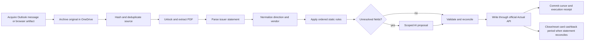

# n8n finance orchestration architecture — 2026-08-19

## Decision

n8n becomes the visible workflow and scheduling layer. The standalone Codex
scheduled tasks are retired issuer by issuer only after the corresponding n8n
workflow passes shadow and guarded-write acceptance.

The workflow canvas must show the financial stages explicitly:



Do not replace this with one opaque HTTP call. Reuse n8n native nodes and
sub-workflows wherever their semantics are sufficient. Implement a custom node
only where n8n has no safe local equivalent.

## Standard-node inventory

| Stage | Preferred n8n capability | Custom code required? |
| --- | --- | --- |
| Schedule and catch-up | Schedule Trigger plus a cursor-minus-overlap sweep | No |
| Outlook acquisition | Microsoft Outlook Trigger for immediacy and Microsoft Outlook/Graph Get Many for the authoritative overlap sweep | No |
| Attachment download | Microsoft Outlook Message Attachment Download | No |
| Evidence archive | Microsoft OneDrive; Graph upload session through HTTP Request when the file exceeds the native upload limit | No |
| Hash | Crypto node | No |
| Filter and routing | Filter, If, Switch, Split Out, Merge, Loop Over Items | No |
| Cursor/rule/config state | Data Tables for operational state; versioned repository JSON remains the deployable contract | No |
| Ordinary PDF text extraction | Extract From File | No |
| Password-protected PDF unlock | Local fixed-purpose QPDF node; password comes from an n8n credential | **Yes** |
| Issuer parsing | One visible parser node per adapter, initially wrapping the existing tested contract and progressively ported to TypeScript | **Yes** |
| Normalization and rule evaluation | Versioned sub-workflows and Data Table-backed rule rows; keep any evaluator small and deterministic | Small evaluator only |
| AI classification | Built-in OpenAI/Structured Output Parser by default; optional pinned Codex provider after security review | No for API provider; optional community node for subscription Codex |
| Actual write | Fixed-purpose Actual node using `@actual-app/api`; serialize writes and keep the local API cache on a persistent volume | **Yes** |
| Failure handling | Error Trigger, Stop And Error, retry settings, and a dedicated operations workflow | No |
| Run lookup | Built-in instance-level n8n MCP `get_workflow_execution` and `search_workflow_executions` | No |

Native ETL nodes remain visible between the parser and the ledger write:
`Split Out` expands statement rows; `Edit Fields` projects the canonical schema;
`Sort` gives stable ordering; `Remove Duplicates` provides a secondary duplicate
guard; `Compare Datasets` compares staged and existing identities; `Merge`
rejoins rule/config data; and `Aggregate`/`Summarize` calculate transaction and
statement totals. The parser is responsible only for source layout. It must not
also hide normalization, rules, AI, reconciliation, or persistence.

The official Outlook trigger has had missed-message and folder edge cases in
real deployments. The trigger is a latency optimization, not the accounting
cursor. A scheduled overlap sweep remains authoritative and advances its cursor
only after archive, processing, Actual verification, and receipt persistence.

## Codex provider decision

There is no official n8n node that bills a workflow to a ChatGPT/Codex
subscription. n8n's official OpenAI nodes use an API credential. A community
package, `n8n-nodes-prodex`, wraps the official Codex SDK/CLI and supports
device-code ChatGPT login, but it is young and runs subscription tokens inside
the n8n environment. It is therefore an **optional pinned provider**, not a
mandatory part of the public deployment, until its code and token lifecycle are
reviewed and an end-to-end structured-output test passes.

The provider-neutral AI sub-workflow accepts only a fixed policy ID and compact
transaction context. It must return the repository's proposal schema. It cannot
change amounts, source identity, dedupe keys, finalized direction/topic,
reconciliation state, or cashback arithmetic.

## PDF decision

Use Extract From File for unencrypted, born-digital PDFs. It does not replace
statement password handling. The default ladder is:

1. fixed-purpose local QPDF validation/unlock node;
2. native n8n Extract From File;
3. deterministic text-density and schema quality gates;
4. optional self-hosted Stirling-PDF OCR/repair;
5. an explicitly approved external provider; otherwise quarantine.

The QPDF node accepts no caller-selected executable, filesystem path, output
path, provider, or shell argument. The password is an n8n credential and the
decrypted artifact is ephemeral. The encrypted original is the durable OneDrive
evidence.

### Third-party PDF options

| Provider | n8n integration | Relevant capability | Finance decision |
| --- | --- | --- | --- |
| Stirling-PDF | HTTP Request to its self-hosted REST API; no dedicated official node | password removal, OCR, repair and format conversion | Preferred optional OCR/repair sidecar because documents remain on the private Docker network. It is a document utility, not a finance worker. |
| PDF Vector | n8n-verified integration | bank-statement parsing and JSON Schema extraction | Best SaaS fallback for an approved difficult statement, after local decryption. Disabled by default and never authoritative without reconciliation. |
| PDF4me | n8n-verified integration | unlock, OCR, tables, bank-statement processing | Capable benchmark/fallback, but both password and document leave the host. Disabled by default. |
| PDF.co | n8n-verified integration | password-aware conversion, OCR, CSV/JSON/table extraction | Technically broad but has a more complex hosted privacy surface. Disabled by default. |
| PDFOps | no verified n8n integration found | public beta currently centers on form filling and merge | Reject for statement ingestion. |
| Unverified community PDF nodes | in-process community packages | varies; most omit password handling or robust OCR | Do not install in production; they expand the n8n process trust boundary. |

External SaaS selection is a deterministic policy decision, never a model
parameter. `config/document-processing.json` currently enables only local
QPDF/native extraction. PDF Vector, PDF4me and PDF.co require explicit approval
for the specific document and remain off until privacy, region, retention,
quota, cost and validation gates are accepted.

### Model-callable document subflows

The model may call `DOCUMENT_EXTRACTION_REQUEST` with only:

```json
{
  "document_id": "staged-document-id",
  "expected_sha256": "64-hex-characters",
  "document_profile": "RAKBANK_CC_STATEMENT",
  "requested_schema_version": "statement-v1"
}
```

The subflow resolves the OneDrive object, password credential, extraction
provider and limits from trusted state. It rejects model-supplied URLs, paths,
providers, passwords, credentials, Actual account IDs and commit flags. Its
receipt contains the input hash, parser/version, result reference, validation
status and provenance. The model never receives an unrestricted PDF vendor
node.

### Extraction resilience

`integrations/n8n/data-tables.json` defines a durable Data Table state machine
stored with n8n in Postgres and separate from execution history:

`RECEIVED → VALIDATED → DECRYPTED → EXTRACTED → SCHEMA_VALIDATED → READY_FOR_PARSE → COMMITTED`

Fail-closed terminal states are `QUARANTINED`, `UNSUPPORTED`, and
`PASSWORD_FAILED`. Data Table upserts use the source-hash/profile/schema tuple
as the idempotency key. Production execution concurrency is limited to one to
prevent competing upserts in this single-main deployment. Every transition
records the n8n execution ID, parser version, input/output hash and a redacted
error class.

- Retry only timeouts, connection failures, 429 and 5xx responses, with bounded
  exponential backoff and jitter.
- Do not retry wrong passwords, corrupt input, unsupported layouts, schema
  failures or balance mismatches without a changed input/configuration.
- Enforce byte, page, decompression, dimension and execution-time limits before
  OCR or external calls.
- Maintain a per-provider circuit breaker; after repeated transient failures,
  skip to the next approved provider or quarantine.
- Store raw binaries in OneDrive and only minimal transient binary data in n8n.
  Do not save PDF bytes, statement text or credentials in successful execution
  outputs.
- Keep replay as a new attempt linked to the immutable original; never mutate
  the original receipt or advance a financial cursor from a quarantined result.

## Workflow boundaries

1. **Acquire Outlook finance documents** — reusable and MCP-enabled. Input is a
   source code and bounded time window. It applies the exact sender, folder,
   subject, and attachment contract, archives originals, and returns immutable
   message/attachment/hash/OneDrive identities.
2. **RAKBANK live cashback scan** — scheduled daily initially, later event-driven
   if desired. It reads every message since the last successful cursor minus the
   configured overlap, parses only the live transaction contract, writes accepted
   events to the cashback store, recalculates routing, and commits the cursor once.
3. **Issuer statement cycle** — one workflow per issuer/card schedule for clear
   operations. It calls acquisition, then the shared deterministic statement
   sub-workflow. EI and Wio are active; RAK and SC stay inactive until their real
   statement adapters and fixtures pass tests. ADCB is closed/historical and has
   no recurring ingestion workflow.
4. **AI proposal** — provider-neutral, bounded, and optional. A deterministic
   run succeeds with review items even if AI is unavailable.
5. **Operations and recovery** — Error Trigger, missed-window sweeps, stale
   cursor detection, statement-not-received warnings, execution retention, and
   MCP-readable diagnostic workflows.
6. **Interactive browser acquisition** — FAB, Sarwa, and Amazon remain
   user-assisted. Their reviewed capture/export artifacts enter the same parse,
   normalize, rule, validate, and Actual-write sub-workflows.
7. **Sweep Outlook messages** — separate attachment-free bounded mail reader for
   live transaction notifications. This prevents live card alerts from being
   coupled to statement/PDF acquisition.
8. **Document extraction request** — model-callable typed façade over trusted
   document records and local extraction. Provider credentials and selection
   remain unreachable from the model.

## MCP use

n8n 2.35.3 has a built-in instance-level MCP server. Expose only bounded
operations workflows, including Outlook acquisition, execution health, and
review-queue reads. Do not expose the unrestricted Actual writer or workflow
authoring surface as a general finance mutation interface.

Codex connects to `https://<n8n-host>/mcp-server/http`. `execute_workflow`
returns an execution ID; callers then poll `get_workflow_execution` or search
executions until a terminal state. Cloudflare Access must allow a dedicated
machine-to-machine path for MCP instead of relying on an interactive AD browser
session.

## Runtime and Cloudflare boundary

- n8n uses a private Postgres container for workflows, credentials, execution
  metadata, and Data Tables. Postgres is not a transaction ledger.
- Regular mode is sufficient. Up to four workflows may execute concurrently,
  but the fixed-purpose Actual node serializes ledger mutations and verifies
  imported IDs before releasing its lock.
- External task runners are used only for Code nodes and must match the n8n
  version. They are not general service or CLI runners.
- Keep Execute Command and SSH nodes excluded.
- Use filesystem binary storage on a persistent volume and prune execution data.
  External S3 binary storage and native Git environments are paid features.
- Store workflows as sanitized JSON in Git. Native n8n Git environments are not
  required for this deployment.
- Publish `n8n.vxsan.com` through the existing Cloudflare Tunnel to
  `http://127.0.0.1:5678`. Leave the origin Host-header override unset. The UI
  can use interactive AD; MCP and unattended webhook paths need a separate
  machine-to-machine Access policy and must never depend on a browser cookie.

There is no ingestion bridge, finance-worker service, SSH submission wrapper,
or host-local ingestion API. The n8n custom Actual node imports directly with
`@actual-app/api` over the private `finance-actual-poc_default` network and uses
the persistent n8n volume for its local Actual cache.

## Cutover gates

An existing Codex schedule may be disabled only after its n8n replacement has:

1. imported inactive and passed a manual fixture run;
2. passed a live shadow run without writing to Actual/cashback;
3. produced the expected source hash, message/attachment IDs, parsed totals,
   rule trace, and review queue;
4. passed a guarded write and UI/API readback;
5. completed three consecutive scheduled runs with bounded retries and no missed
   cursor window.

Until then, `config/codex-automations.json` remains the installed-state contract
and the n8n registry records the replacement as `SHADOW` or `PAUSED`.

## Primary references

- [n8n Microsoft Outlook Trigger](https://docs.n8n.io/integrations/builtin/trigger-nodes/n8n-nodes-base.microsoftoutlooktrigger/)
- [n8n Extract From File](https://docs.n8n.io/integrations/builtin/core-nodes/n8n-nodes-base.extractfromfile/)
- [n8n task runners](https://docs.n8n.io/hosting/configuration/task-runners/)
- [n8n instance MCP](https://docs.n8n.io/connect/connect-to-n8n-mcp-server/)
- [n8n MCP tool reference](https://docs.n8n.io/connect/connect-to-n8n-mcp-server/mcp-server-tools-reference/)
- [n8n source-control availability](https://docs.n8n.io/source-control-environments/create-environments/)
- [Codex non-interactive mode](https://learn.chatgpt.com/docs/non-interactive-mode)
- [ProDex community node](https://github.com/artNcraft/n8n-nodes-prodex)
- [n8n data transformation nodes](https://docs.n8n.io/data/transforming-data/)
- [n8n Execute Sub-workflow](https://docs.n8n.io/integrations/builtin/core-nodes/n8n-nodes-base.executeworkflow/)
- [n8n Call n8n Workflow Tool](https://docs.n8n.io/integrations/builtin/cluster-nodes/sub-nodes/n8n-nodes-langchain.toolworkflow/)
- [n8n security audit and community-node checks](https://docs.n8n.io/hosting/securing/security-audit/)
- [Stirling-PDF API](https://docs.stirlingpdf.com/API/)
- [PDF Vector n8n integration](https://n8n.io/integrations/pdf-vector/)
- [PDF4me n8n integration](https://n8n.io/integrations/pdf4me/)
- [PDF.co n8n integration](https://n8n.io/integrations/pdfco-api/)
